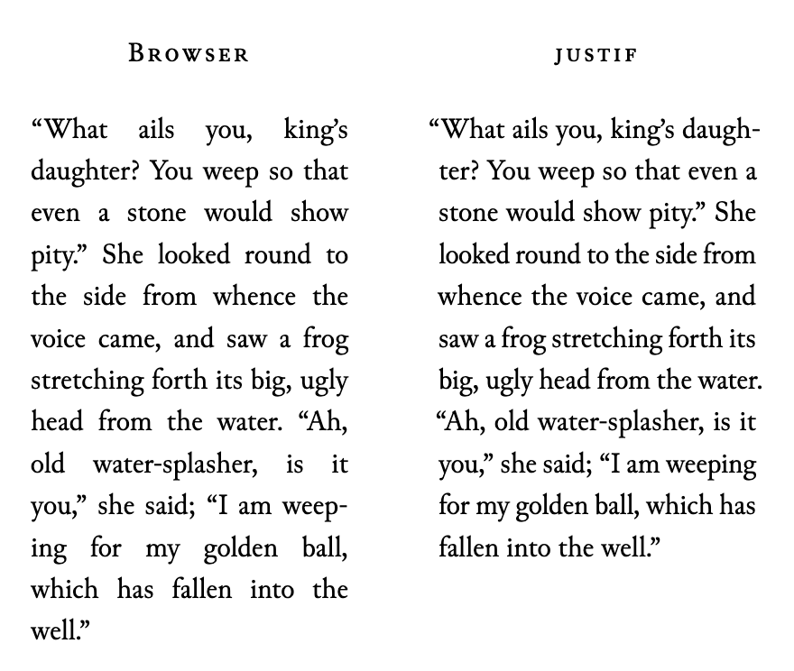

# justif

_Publication-grade text justification for the web._

justif is a JavaScript library that applies TeX-style paragraph layout to
existing HTML. It chooses line breaks across the whole paragraph and uses
hyphenation and microtypography techniques to produce more even spacing than
the browser's built-in justification.

It is a progressive enhancement. Your HTML and CSS provide the initial and
fallback rendering, while justif upgrades paragraphs it can measure reliably.
Unsupported paragraphs are left untouched. When JavaScript is disabled, native
rendering is unchanged.

Visit the [**live demo**](https://justif.lyall.co) to see it in action and
compare it with your browser's built-in justification.

## Why it exists

Browsers normally justify one line at a time. A locally acceptable break can
make the next line too loose, create visible rivers of whitespace, or force a
poor break near the end of the paragraph.

<p align="center">
  <br>
  <em>Native browser vs. justif rendering, Google Chrome.</em>
</p>

justif uses the [Knuth–Plass line-breaking
algorithm](https://en.wikipedia.org/wiki/Knuth%E2%80%93Plass_line-breaking_algorithm)
to evaluate a paragraph as a whole. It can also:

- hyphenate words using bundled TeX patterns;
- hang punctuation into the margin for a cleaner text edge;
- make small per-line width adjustments on variable fonts with a `wdth` axis;
- make small letter-spacing (tracking) adjustments when needed;
- justify CJK text between characters with Japanese kinsoku rules.

The result remains inline HTML. Links, emphasis, selection, copying,
find-in-page, and assistive technology keep normal paragraph semantics.

## Quick start

### Add one script

Keep native justification in your CSS, then load the automatic entry in
your `<head>`:

```html
<style>
  article p {
    text-align: justify;
  }
</style>

<script
  type="module"
  blocking="render"
  src="https://cdn.jsdelivr.net/npm/justif@0.3.0/dist/auto.js"
></script>
```

The script scans `p`, `li`, `dd`, `blockquote`, and `figcaption` elements once
the DOM is ready. It enhances only elements whose computed `text-align` is
`justify` or `justify-all`.

Set the page language so the correct hyphenation rules are used:

```html
<html lang="en-US">
```

Unlabeled and generic English content uses American English. Other bundled
languages are loaded on demand. If a language is not bundled, the text is
still justified without automatic hyphenation.

To limit the automatic scan, add a `data-justif-selector` such as `"article
.prose p"` to the script tag.

Add `data-justif-debug` to log why a paragraph kept native justification.
With the JavaScript API, pass `onSkip` instead.

### Loading and first paint

Adding `blocking="render"` prevents the browser from painting native
justification before justif runs. The trade-off is a slower first paint: the
browser waits for the script to download and execute. Omit the attribute if
first-paint speed matters more than avoiding the visible change.
Browsers without support, [currently
Firefox](https://caniuse.com/wf-blocking-render), may briefly show native
justification while the script loads. For languages whose hyphenation patterns
load on demand, the first paint is justified without hyphens; hyphenation
arrives with the pattern file.

A few things make the loading experience smoother:

- Self-host the package's entire `dist/` directory without changing its
  structure, and serve it with long-lived caching. It loads ahead of first
  paint, so repeat visits should come from cache.
- Standard web font best practices apply: preload them and match the fallback
  font's metrics to the web font. Text in a font that is still loading is
  justified in the fallback font and re-justifies when the font arrives, so
  the earlier that happens, the better.
- On very long pages, keep off-screen paragraphs out of layout work.
  justif keeps their placeholder heights exact, so scrollbars and anchors
  stay stable:

  ```css
  article p {
    content-visibility: auto;
    contain-intrinsic-size: auto 8em;
  }
  ```

### Advanced: controlling the drop-in script

The script exposes a `window.justif` object containing `justify`, `unjustify`,
`controllers`, and a `booted` promise. Most pages can ignore `window.justif`. It
is provided for integrations that need to inspect, control, or safely tear down
the drop-in script. Before assuming `controllers` is complete, await
`window.justif.booted`: controllers for on-demand languages may be added later.

```js
await window.justif.booted;

for (const controller of window.justif.controllers) {
  controller.destroy();
}
```

### Use the JavaScript API

Install the package:

```sh
npm install justif
```

Then choose the elements and hyphenator explicitly:

```js
import { justify } from "justif";
import { hyphenateEnUS } from "justif/hyphenate/en-us";

const controller = justify(document.querySelectorAll("article p"), {
  hyphenate: hyphenateEnUS,
});
```

`justify()` applies its initial layout before returning. Await
`controller.ready` only when you need to wait for relevant fonts to load or
fail, and for any resulting font-driven layout to finish. Call
`controller.destroy()` later to restore the original DOM and disconnect
observers.

Container width changes and newly loaded web fonts are handled automatically.
`refresh()` forces a re-measure for changes justif cannot observe — for
example a container width change with `observeResize: false`. If paragraph
content or its computed text styles change, call `destroy()` and
run `justify()` again so the paragraph can be rescanned.

`justify()` accepts one `Element` or any iterable of elements. The returned
controller exposes `ready`, `refresh()`, `destroy()`, and the selected
`paragraphs`. `unjustify(elements)` can restore elements without access to
their original controller.

## Hyphenation

The automatic script selects hyphenators from the nearest `lang` attribute.
With the JavaScript API, import one hyphenator per language group:

```js
import { justify } from "justif";
import { hyphenateDe } from "justif/hyphenate/de";

justify(document.querySelectorAll("p:lang(de)"), {
  hyphenate: hyphenateDe,
});
```

The package includes Catalan, Croatian, Danish, Dutch, English (US and GB),
Finnish, French, German, Greek, Hungarian, Italian, Norwegian Bokmål and
Nynorsk, Polish, Portuguese, Russian, Slovak, Slovenian, Spanish, Swedish,
Turkish, and Ukrainian.

You can also pass any function with this shape:

```js
const exceptions = new Map([
  ["typography", ["ty", "pog", "ra", "phy"]],
]);

const hyphenate = (lowercaseWord) =>
  exceptions.get(lowercaseWord) ?? [lowercaseWord];
```

The returned fragments must join back to the input word. Author-provided soft
hyphens are honored without a callback. Add `hyphens: none` to an inline
element, such as `code`, to suppress both automatic and soft hyphenation
inside it.

## Options

These are the options most applications need:

| Option | Default | What it controls |
| --- | --- | --- |
| `hyphenate` | none | Splits a lowercase word into hyphenatable fragments |
| `protrusion` | `true` | Enables optical margin alignment; pass `false` or a character table |
| `hangingPunctuation` | `"first-line"` | Controls full hanging punctuation at line edges; also accepts `"all-lines"` or `false` |
| `expansion` | `{ max: 0.02, shrink: 0.02, step: 0.005 }` | Uses a variable font's `wdth` axis to improve line fit; ignored when unavailable |
| `tracking` | `{ max: 0.03, shrink: 0.03 }` | Uses small letter-spacing adjustments to improve line fit; `false` disables |
| `spacing` | `{ stretch: 0.5, shrink: 1/3, pull: 0.7, boundaryShrink: 0 }` | Sets how far word spaces may stretch or shrink |
| `lastLineMinWidth` | `0.33` | Sets the target minimum ending length as a fraction of the measure; `0` disables, `1` means rectangular paragraphs whenever reasonable |
| `lastLineFit` | `0` | Carries the paragraph's average spacing adjustment into the last line; `1` applies it fully |
| `observeResize` | `true` | Reflows managed paragraphs when their width changes |
| `cleanClipboard` | `true` | Removes layout-only characters from copied text while preserving author nonbreaking spaces |
| `onRelayout` | none | Callback that runs after initial layout, resize, refresh, or a font-driven re-layout |
| `onSkip` | none | Callback that reports why a paragraph kept native layout |

The default `lastLineMinWidth` follows the traditional “at least a third”
guideline. Set it to `1` for rectangular paragraphs where the ending can reach
the full measure without poor spacing.

### Expansion, tracking, and spacing

These settings use fractions: `0.02` means 2%. Set either `expansion`
or `tracking` to `false` to disable that adjustment.

| Setting | What it controls |
| --- | --- |
| `expansion.max` | How far a variable font may widen; `0.02` allows up to `102%` font stretch |
| `expansion.shrink` | How far a variable font may narrow; `0.02` allows down to `98%` font stretch |
| `expansion.step` | Size of each width adjustment; `0.005` gives 0.5% steps |
| `tracking.max` | How much the text on a line may widen through added letter spacing; `0.03` allows 3% |
| `tracking.shrink` | How much the text on a line may tighten through reduced letter spacing; `0.03` allows 3% |
| `spacing.stretch` | How much a word space may grow; `0.5` allows up to 150% of its natural width |
| `spacing.shrink` | How much a word space may contract; `1/3` allows down to about 67% of its natural width |
| `spacing.pull` | How strongly wider spaces from secondary fonts move toward the main font's space width; `0` preserves them and `1` matches the main font |
| `spacing.boundaryShrink` | How much shrinking is allowed where font families meet, such as around inline code or chips; `0` prevents it and `1` uses the full shrink allowance |

### Advanced line breaking

Most applications should keep these defaults. “Badness” is TeX's score for
uneven word spacing; lower is better.

| Option | Default | What it controls |
| --- | --- | --- |
| `tolerance` | `200` | Highest line badness accepted after hyphenation is available |
| `pretolerance` | `100` | Highest badness accepted before trying hyphenation; a negative value skips this pass |
| `linePenalty` | `10` | Base cost per line; higher values favor fewer lines |
| `hyphenPenalty` | `50` | Cost of an automatic hyphenation break; higher values discourage it |
| `exHyphenPenalty` | `50` | Cost of breaking after a hyphen already present in the text |
| `adjDemerits` | `10000` | Cost of sharply different spacing on adjacent lines |
| `doubleHyphenDemerits` | `10000` | Cost of hyphenating two consecutive lines |
| `finalHyphenDemerits` | `5000` | Cost of hyphenating the line immediately before the final line |
| `emergencyStretch` | `"auto"` ≈ `3em` | Extra word-space flexibility used only when normal passes fail; `0` disables |

## Supported content

justif supports horizontal LTR text, CJK text, and pure RTL Hebrew or Arabic
paragraphs. Computed `font-variant-*` values and low-level
`font-feature-settings` are preserved and measured with their actual glyph
substitutions.

### Inline content

Inline markup such as links, `em`, `strong`, and `code` may wrap across lines.
Horizontal padding and borders on `code`, `kbd`, badges, and other inline
elements are included in the layout. When an inline element uses a different
font family, the spaces beside it do not shrink. An element with
`white-space: nowrap` never breaks inside. Padding follows
`box-decoration-break: slice` when an element wraps.

### Browser fallback

justif leaves a paragraph on native browser layout when it cannot reproduce it
reliably. This includes:

- mixed LTR and RTL text;
- vertical writing, Thai, and Lao;
- images, form controls, `<br>`, SVG, MathML, floats, or block descendants;
- inline descendants with horizontal margins, `box-decoration-break: clone`,
  or preserved-whitespace `white-space` values;
- `contenteditable` paragraphs.

Use padding rather than horizontal margins for chip insets.

Keep `text-align: justify` in your CSS so these paragraphs still have a useful
fallback. One unsupported paragraph does not prevent its siblings from being
enhanced.

### Interactive inline content

While justif manages a paragraph, it renders its inline descendants as clones.
Use delegated event handlers for interactive inline content. Event listeners
attached directly to the original descendants are not copied to the clones;
they work again after `destroy()`. Existing JavaScript references still point
to the originals, not the rendered clones.

## Browser requirements

justif requires a modern browser with canvas text measurement, the CSS
Font Loading API (`document.fonts`), and CSS logical margins.
`ResizeObserver` is needed for the default `observeResize: true`
re-layout; `IntersectionObserver` is an optimization used when available.
Importing the package during SSR is safe, but `justify()` only enhances
content in a browser. The DOM-free layout engine is available from
`justif/core` for custom renderers.

## License

MIT. Bundled hyphenation patterns retain the licenses recorded in their
module headers.
