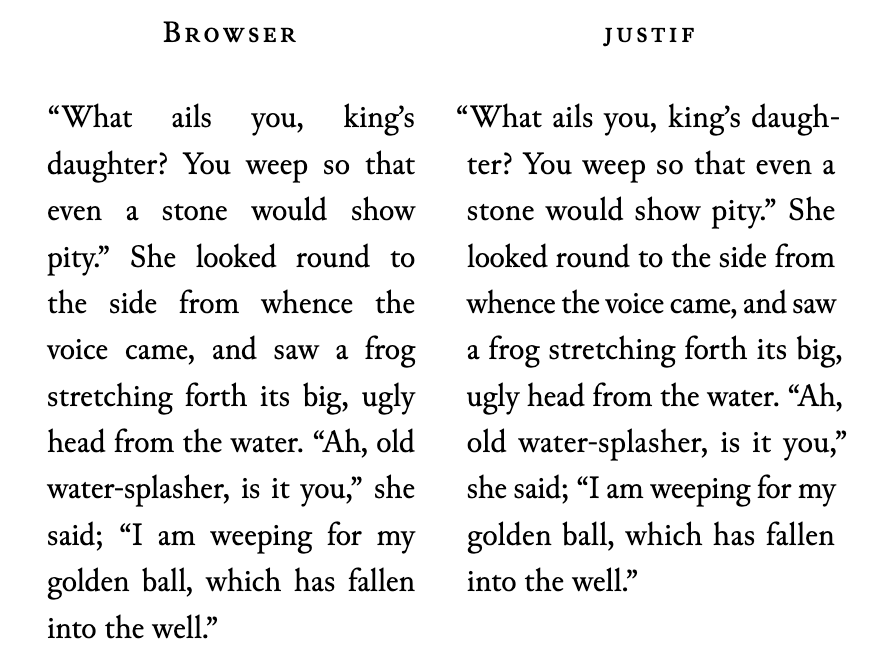

# Justif

_Text justification for perfectionists._

Justif is a JavaScript library that applies TeX-style paragraph layout to
existing HTML, upgrading justified text on your website to print-quality. Justif
chooses line breaks across the whole paragraph and uses hyphenation and
microtypography techniques to produce more even spacing than the browser's
built-in justification. It makes text easier and more enjoyable to read.

It is a progressive enhancement. Your HTML and CSS provide the initial and
fallback rendering, while Justif upgrades paragraphs it can measure reliably.
Unsupported paragraphs are left untouched. When JavaScript is disabled, native
rendering is unchanged.

Visit the [**live demo**](https://justif.lyall.co) to see it in action and
compare it with your browser's built-in justification.

## Why it exists

Browsers normally justify one line at a time. A locally acceptable break can
make the next line too loose, create visible rivers of whitespace, or force a
poor break near the end of the paragraph.

<p align="center">
  <a href="https://justif.lyall.co">
    <picture>
      <source
        media="(prefers-color-scheme: dark)"
        type="image/avif"
        srcset="docs/images/browser-vs-justif-dark.avif"
      >
      <source
        media="(prefers-color-scheme: dark)"
        srcset="docs/images/browser-vs-justif-dark.png"
      >
      <source
        type="image/avif"
        srcset="docs/images/browser-vs-justif.avif"
      >
      
    </picture>
  </a><br>
  <em>Native browser vs. Justif rendering, Google Chrome.</em>
</p>

Justif uses the [Knuth–Plass line-breaking
algorithm](https://en.wikipedia.org/wiki/Knuth%E2%80%93Plass_line-breaking_algorithm)
to evaluate a paragraph as a whole. It can also:

- hyphenate words using bundled TeX patterns;
- hang punctuation into the margin for a cleaner text edge;
- make small per-line width adjustments on variable fonts with a `wdth` axis;
- make small letter-spacing (tracking) adjustments when needed;
- justify CJK text between characters with Japanese kinsoku rules.

The result remains inline HTML. Links, emphasis, selection, copying,
find-in-page, and assistive technology keep normal paragraph semantics.

## Quick start

### Add one script

Keep native justification in your CSS, then load the automatic entry in
your `<head>`:

```html
<style>
  article p {
    text-align: justify;
  }
</style>

<!-- The integrity hash needs to be updated or omitted when updating versions -->
<script
  type="module"
  blocking="render"
  src="https://cdn.jsdelivr.net/npm/justif@0.8.1/dist/auto.js"
  integrity="sha384-JGV7LEbpiA27cZO7Z4PZFZsoqyVT/6C3la6FrO2Auzbuik8/JEigN7RswC6iyaGA"
  crossorigin="anonymous"
></script>
```

The script scans `p`, `li`, `dd`, `blockquote`, and `figcaption` elements once
the DOM is ready. It enhances only elements whose computed `text-align` is
`justify` or `justify-all`.

Set the page language so the correct hyphenation rules are used:

```html
<html lang="en-US">
```

Unlabeled and generic English content uses American English. Other bundled
languages are loaded on demand. If a language is not bundled, the text is
still justified without automatic hyphenation.

To limit the automatic scan, add a `data-justif-selector` such as `"article
.prose p"` to the script tag.

Add `data-justif-debug` to log why a paragraph kept native justification.
With the JavaScript API, pass `onSkip` instead.

To change how the text is set, use `--justif-*` custom properties in your CSS,
on the page or on individual sections: see [Setting options in
CSS](#setting-options-in-css).

### Use the JavaScript API

Install the package:

```sh
npm install justif
```

Then choose the elements and hyphenator explicitly:

```js
import { justify } from "justif";
import { hyphenateEnUS } from "justif/hyphenate/en-us";

const controller = justify(document.querySelectorAll("article p"), {
  hyphenate: hyphenateEnUS,
});
```

`justify()` applies its initial layout before returning. Await
`controller.ready` only when you need to wait for relevant fonts to load or
fail, and for any resulting font-driven layout to finish. Call
`controller.destroy()` later to restore the original DOM and disconnect
observers.

Container width changes and newly loaded web fonts are handled automatically.
`refresh()` forces a re-measure for changes Justif cannot observe, for
example a container width change with `observeResize: false`. After changing the
CSS of paragraphs already justified—`hyphens`, the font, `letter-spacing`,
`line-height`, `text-indent`, `min-width`, `contain`—call `rescan()`, which re-reads author
CSS and re-lays out only the paragraphs whose styling actually changed.
Paragraphs it previously declined are reconsidered too. If paragraph *content*
changes, call `destroy()` and run `justify()` again.

`justify()` accepts one `Element` or any iterable of elements. The returned
controller exposes `ready`, `refresh()`, `rescan()`, `destroy()`, the selected
`paragraphs`, and `managed` — the paragraphs it is still responsible for, which
excludes any it declined and any released since. `unjustify(elements)` can
restore elements without access to their original controller.

### Loading and first paint

Adding `blocking="render"` prevents the browser from painting native
justification before Justif runs. The trade-off is a slower first paint: the
browser waits for the script to download and execute. Omit the attribute if
first-paint speed matters more than avoiding the visible change.
Browsers without support, [currently
Firefox](https://caniuse.com/wf-blocking-render), may briefly show native
justification while the script loads. For languages whose hyphenation patterns
load on demand, the first paint is justified without hyphens; hyphenation
arrives with the pattern file.

A few things make the loading experience smoother:

- Self-host the package's entire `dist/` directory without changing its
  structure, and serve it with long-lived caching. It loads ahead of first
  paint, so repeat visits should come from cache.
- Standard web font best practices apply: preload them and match the fallback
  font's metrics to the web font. Text in a font that is still loading is
  justified in the fallback font and re-justifies when the font arrives, so
  the earlier that happens, the better.
- On very long pages, keep off-screen paragraphs out of layout work.
  Justif keeps their placeholder heights exact, so scrollbars and anchors
  stay stable:

  ```css
  article p {
    content-visibility: auto;
    contain-intrinsic-size: auto 8em;
  }
  ```

### Advanced: controlling the drop-in script

The script exposes a `window.justif` object containing `justify`, `unjustify`,
`controllers`, `reconfigure()`, and a `booted` promise. Most pages can ignore
`window.justif`. It is provided for integrations that need to inspect, control,
or safely tear down the drop-in script. Before assuming `controllers` is
complete, await `window.justif.booted`: controllers for on-demand languages may
be added later.

There is one controller per language and configuration, so a `--justif-*` change
can add or remove entries; the array is updated in place. `booted` covers only
the initial load, and `reconfigure()` returns a promise for later changes. A
paragraph you tear down by hand stays torn down.

```js
await window.justif.booted;

for (const controller of window.justif.controllers) {
  controller.destroy();
}
```

## Hyphenation

The drop-in auto.js script selects hyphenators from the nearest `lang`
attribute. With the JavaScript API, import one hyphenator per language group:

```js
import { justify } from "justif";
import { hyphenateDe } from "justif/hyphenate/de";

justify(document.querySelectorAll("p:lang(de)"), {
  hyphenate: hyphenateDe,
});
```

The package includes Catalan, Croatian, Danish, Dutch, English (US and GB),
Finnish, French, German, Greek, Hungarian, Italian, Norwegian Bokmål and
Nynorsk, Polish, Portuguese, Russian, Slovak, Slovenian, Spanish, Swedish,
Turkish, and Ukrainian.

You can also pass any function with this shape:

```js
const exceptions = new Map([
  ["typography", ["ty", "pog", "ra", "phy"]],
]);

const hyphenate = (lowercaseWord) =>
  exceptions.get(lowercaseWord) ?? [lowercaseWord];
```

The returned fragments must join back to the input word. Author-provided soft
hyphens are honored without a callback.

`hyphens: none` suppresses both automatic and soft hyphenation wherever you set
it — a paragraph, a section, or a single inline element such as `code`. It is the
native CSS property, so the browser's own rendering matches.

## Options

Options are passed to `justify()`, or set in CSS when you use the drop-in script
(see [Setting options in CSS](#setting-options-in-css)). These are the ones most
applications need:

| Option | CSS property | Default | What it controls |
| --- | --- | --- | --- |
| `hyphenate` | `hyphens: none` turns it off | none | Splits a lowercase word into hyphenatable fragments |
| `protrusion` | `--justif-protrusion` | `true` | Optically aligns glyphs at line edges; `false` disables it, or pass a character table to use built-in values plus your overrides |
| `hangingPunctuation` | `--justif-hanging-punctuation`, `--justif-hanging-characters-start`, `--justif-hanging-characters-end` | `"line-end-only"` | Controls which line edges hang punctuation fully — `"line-end-only"`, `"first-line-and-line-ends"`, `"all-line-edges"`, or `"none"` — and which characters hang there |
| `expansion` | `--justif-expansion` | `{ max: 0.02, shrink: 0.02, step: 0.005 }` | Uses a variable font's `wdth` axis to improve line fit; ignored when unavailable |
| `tracking` | `--justif-tracking` | `{ max: 0.03, shrink: 0.03 }` | Uses small letter-spacing adjustments to improve line fit; `false` disables |
| `spacing` | `--justif-space-stretch`, `--justif-space-shrink` | `{ stretch: 0.5, shrink: 1/3, pull: 0.7, boundaryShrink: 0 }` | Sets how far word spaces may stretch or shrink |
| `lastLineMinWidth` | `--justif-last-line-min-width` | `0.33` | Sets the target minimum ending length for multi-line paragraphs as a fraction of the measure; `0` disables, `1` also fills reachable one-line paragraphs |
| `lastLineFit` | `--justif-last-line-fit` | `0` | Carries the paragraph's average spacing adjustment into the last line; `1` applies it fully |
| `observeResize` | — | `true` | Reflows managed paragraphs when their width changes |
| `cleanClipboard` | — | `true` | Removes layout-only characters from copied text while preserving author nonbreaking spaces |
| `onRelayout` | — | none | Callback that runs after initial layout, resize, refresh, or a font-driven re-layout |
| `onSkip` | — | none | Callback that reports why a paragraph kept native layout |

The default `lastLineMinWidth` follows the traditional “at least a third”
guideline. Set it to `1` for rectangular paragraphs where the ending can reach
the full measure without poor spacing. Naturally one-line elements otherwise
stay in native layout; they become enhanced if a narrower measure makes them
wrap, and return to native layout when they fit again. CSS
`text-align: justify-all` is treated like the rectangular `1` mode.

### Setting options in CSS

With the drop-in script, set the properties above on any element. They inherit,
so `:root` configures a page, a selector configures a section, and an inline
style covers one paragraph:

```css
:root {
  --justif-tracking: none;
  --justif-last-line-min-width: 50%;
}

blockquote {
  --justif-hanging-punctuation: none;
}
```

Use `none` to switch off a feature and `auto` to set it back to the default;
`false` and `true` work as well, wherever `none` and `auto` do. Fractions can be
written either way, so `0.33` and `33%` are the same. Invalid values are ignored
and the default applies. One value covers both directions for
`--justif-expansion` and `--justif-tracking`—use the JavaScript API for more
advanced configuration.

Justif automatically watches for changes to your CSS and updates accordingly —
both these properties and the ordinary ones a paragraph's layout depends on, so a
theme toggle that switches `hyphens` or the body font re-lays out on its own.
There are some restrictions. Older browsers (older than Chrome 117, Safari 17.4,
Firefox 129) won't update automatically. And paragraphs that have their own
`transition` property but don't declare the property in question will also not be
updated, since Justif uses transitions internally to track updates. In either case
you can use `window.justif.reconfigure()` to apply changes manually as needed.
Changes to `min-width` and `contain` also require `reconfigure()`, because
browsers do not emit the transition signal Justif uses to observe them.

### Protrusion and hanging punctuation

By default, Justif will protrude characters slightly into the margin to create
the appearance of a straighter margin. This is also known as optical margin
alignment. Justif dynamically evaluates each character to determine the
appropriate amount to adjust the character's alignment at the margin edge. Set
`protrusion` to `false` to disable this behavior, or pass a character table to
provide your own values and disable the dynamic font measuring. Passed values
are merged with a built-in table of values in Justif, so passing `{}` tells
Justif to only use its built-in table and not dynamically measure characters.

Justif also fully hangs punctuation into the margin at the end of every line by
default. Set `hangingPunctuation` to `"none"` to disable it, or
pass `"all-line-edges"` for fully hanging punctuation everywhere. Between those,
`"first-line-and-line-ends"` is the CSS `hanging-punctuation: first` model: an
opening quote hangs fully where it starts the paragraph, and later line starts
set those marks flush.

Pass an object to choose which characters hang at each edge. Each side replaces
the built-in set, so build from the exported `hangingCharacters` to extend it;
brackets are not hung by default. An empty string hangs nothing at that edge.

```js
import { hangingCharacters, justify } from "justif";

justify(document.querySelectorAll("p"), {
  hangingPunctuation: {
    edges: "all-line-edges",
    characters: { start: hangingCharacters.start + "([{" },
  },
});
```

In CSS the sets are quoted strings:
`--justif-hanging-characters-start: "‘’“”([{"`.

Protrustion and hanging are independent. With protrusion off and hanging on,
letters sit exactly flush while quotes and stops still hang. Switch off both for
no margin effects at all.

### Expansion, tracking, and spacing

These settings use fractions: `0.02` means 2%. Set either `expansion`
or `tracking` to `false` to disable that adjustment.

| Setting | What it controls |
| --- | --- |
| `expansion.max` | How far a variable font may widen; `0.02` allows up to `102%` font stretch |
| `expansion.shrink` | How far a variable font may narrow; `0.02` allows down to `98%` font stretch |
| `expansion.step` | Size of each width adjustment; `0.005` gives 0.5% steps |
| `tracking.max` | How much the text on a line may widen through added letter spacing; `0.03` allows 3% |
| `tracking.shrink` | How much the text on a line may normally tighten through reduced letter spacing; `0.03` allows 3% |
| `spacing.stretch` | How much a word space may grow; `0.5` allows up to 150% of its natural width |
| `spacing.shrink` | How much a word space may contract; `1/3` allows down to about 67% of its natural width |
| `spacing.pull` | How strongly wider spaces from secondary fonts move toward the main font's space width; `0` preserves them and `1` matches the main font |
| `spacing.boundaryShrink` | How much shrinking is allowed where font families meet, such as around inline code or chips; `0` prevents it and `1` uses the full shrink allowance |

### Advanced tuning

Most applications should keep these defaults. “Badness” is a TeX-like score for
uneven word spacing; lower is better.

| Option | Default | What it controls |
| --- | --- | --- |
| `tolerance` | `200` | Highest line badness accepted after hyphenation is available |
| `pretolerance` | `100` | Highest badness accepted before trying hyphenation; a negative value skips this pass |
| `linePenalty` | `10` | Base cost per line; higher values favor fewer lines |
| `hyphenPenalty` | `50` | Cost of an automatic hyphenation break; higher values discourage it |
| `exHyphenPenalty` | `50` | Cost of breaking after a hyphen already present in the text |
| `adjDemerits` | `10000` | Cost of sharply different spacing on adjacent lines |
| `doubleHyphenDemerits` | `10000` | Cost of hyphenating two consecutive lines |
| `finalHyphenDemerits` | `5000` | Cost of hyphenating the line immediately before the final line |
| `emergencyStretch` | `"auto"` ≈ `3em` | Extra word-space flexibility used only when normal passes fail; `0` disables |

## Supported content

Justif supports horizontal LTR text, CJK text, and pure RTL Hebrew or Arabic
paragraphs. Computed `font-variant-*` values and low-level
`font-feature-settings` are preserved and measured with their actual glyph
substitutions.

### Inline content

Inline markup such as links, `em`, `strong`, and `code` may wrap across lines.
Horizontal padding and borders on `code`, `kbd`, badges, and other inline
elements are included in the layout. When an inline element uses a different
font family, the spaces beside it do not shrink. An element with
`white-space: nowrap` never breaks inside. Padding follows
`box-decoration-break: slice` when an element wraps. A painted inline box
(a nontransparent background/background image, or a visible outset shadow
that reaches an inline side) defines the optical margin at its line fragments.
Transparent shadow reservations, inset shadows, and sharp (zero-blur)
vertical-only underline shadows keep ordinary glyph protrusion. A blurred
vertical shadow can reach both horizontal sides and therefore counts as a
halo. When protrusion is enabled, its side padding and border can hang outside
the measure when the element opens or closes at a line edge, keeping the text
inside aligned with the surrounding prose; glyphs do not protrude through an
unpadded halo at those real outer edges. At an internal
`box-decoration-break: slice` edge, the element has not actually closed, so
terminal punctuation and inserted hyphens retain their ordinary character
protrusion. With
`protrusion: false`, the entire painted box stays inside the measure. If a
single unbreakable painted token fits only without its fixed insets, enabled
tracking may use up to one additional shrink budget (6% total under the
default) to retain those insets instead of overflowing or inventing a break
inside code. With tracking disabled—or a token still too wide after that
bounded fallback—ordinary overfull-line behavior remains.

### Inline math and other inline objects

Inline-level boxes that the browser lays out as a single object—rendered math
(KaTeX, MathJax's CommonHTML output, or native `<math>`), `inline-block` chips,
`inline-flex` and `inline-grid` elements—are set as fixed, unbreakable boxes at
the width they have in your own layout. The text around them is justified
normally, and a line may break before or after such a box, but never inside it.
Where a rendered formula is split into several boxes (KaTeX splits at relations
and operators), lines may break between them, which is where TeX breaks
displayed relations too.

An object's own typography is left alone: the letter-spacing, word-spacing and
font-stretch that justification applies to a line stop at its edge, so an
equation is never stretched or tracked to fill a line.

Math needs no configuration. If you use KaTeX, either output mode works, and
the accessible MathML that its default output carries is preserved.

Objects wrapping content that cannot be copied faithfully—a `canvas`, a media
element, a form control, an `iframe`, or a shadow root—leave the paragraph on
native rendering, as do images and SVG, whose size can still change after the
page has been measured.

An object's width is read when the paragraph is scanned. Rendered math and
chips are sized by their own content, so that width holds at any measure; an
object sized against the measure itself—a percentage width, or an
`inline-block` wide enough that its own text rewraps—is re-read by `rescan()`
rather than on resize.

### Hard line breaks

Inline `<br>` elements are preserved as real breaks. The default behavior is to
leave the text on the line ending with `<br>` as ragged, though proceeding line
breaks and spacing may be adjusted to try and meet the configured
`lastLineMinWidth` value. This behavior is analagous to TeX's `\newline`, with
our `lastLineMinWidth` policy layered on top.

If the paragraph element has a `text-align-last` value of `justify`, then Justif
will attempt to fully justify lines ending with `<br>`. This is analagous to
TeX's `\linebreak`.

### Browser fallback

Justif leaves a paragraph on native browser layout when it cannot reproduce it
reliably. This includes:

- mixed LTR and RTL text;
- vertical writing, Thai, and Lao;
- images, form controls, SVG, or block descendants in the text flow;
- floats, except a single one as the paragraph's first child;
- inline descendants with horizontal margins, `box-decoration-break: clone`,
  or preserved-whitespace `white-space` values;
- `text-transform: capitalize` (other `text-transform` values are supported);
- `contenteditable` paragraphs.

Use padding rather than horizontal margins for chip insets.

Keep `text-align: justify` in your CSS so these paragraphs still have a useful
fallback. One unsupported paragraph does not prevent its siblings from being
enhanced.

### Interactive inline content

While Justif manages a paragraph, it renders its inline descendants as clones.
Use delegated event handlers for interactive inline content. Event listeners
attached directly to the original descendants are not copied to the clones;
they work again after `destroy()`. Existing JavaScript references still point
to the originals, not the rendered clones.

## Browser support

### Requirements

Justif requires a modern browser with canvas text measurement, the CSS
Font Loading API (`document.fonts`), and CSS logical margins.
`ResizeObserver` is needed for the default `observeResize: true`
re-layout; `IntersectionObserver` is an optimization used when available.
Importing the package during SSR is safe, but `justify()` only enhances
content in a browser. The DOM-free layout engine is available from
`justif/core` for custom renderers.

### iOS Safari text sizing

On iOS Safari, Justif disables automatic text inflation on enhanced
paragraphs. Font boosting can change after measurement and uses fragment
heuristics that measurement probes cannot reproduce, invalidating per-line
spacing after rotation.

The rest of the page keeps its own text-sizing policy. On desktop-layout pages
that rely on Safari's inflation, enhanced prose may look smaller than
surrounding unenhanced text. Use responsive font sizing or leave those
paragraphs out of the justification target.

## AI Usage Disclosure

AI/LLM-based tools are used as part of the Justif development process.
Nonetheless, we hold ourselves and the project to a high standard. We strive to
ensure that every feature is well tested and every design choice well
considered. Our goal is to use AI tools where appropriate to achieve a
previously unreasonable level of quality and polish. Constructive feedback is
always welcome.

## License

MIT. Bundled hyphenation patterns retain the licenses recorded in their
module headers.
